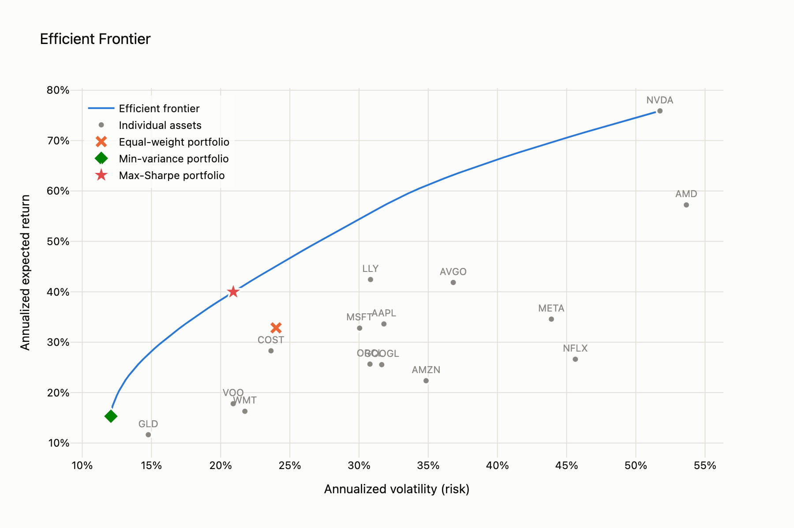

# Portfolio optimizer (Markowitz mean-variance)

A small tool that takes a list of tickers, pulls historical prices, and computes the efficient frontier: the set of portfolios that gets you the most expected return for a given level of risk. Given a target return or a risk budget, it hands back the specific weights. It also plots the frontier and checks whether any of this actually beat just splitting your money evenly across the same tickers.

## The theory, briefly

Harry Markowitz's 1952 idea, still the starting point for most portfolio construction: don't judge an asset by its return alone, judge a *portfolio* by its return and its variance together.

- **Expected return** of a portfolio is just the weighted average of each asset's expected return.
- **Variance** (risk) of a portfolio is not the weighted average of the assets' variances. It also depends on how the assets move together, the covariance. Two volatile assets that move in opposite directions can combine into a portfolio that's calmer than either one alone.
- That second fact is the whole reason diversification works. If you hold assets whose returns aren't perfectly correlated, the ups and downs partially cancel out, so the portfolio's volatility ends up lower than a simple average of its parts' volatility. Adding GLD (gold) and VOO (S&P 500) to a pile of tech stocks is doing exactly this: gold and equities do not move together, so mixing them in should knock down portfolio variance more than adding another tech stock would.
- The **efficient frontier** is the curve of portfolios that minimize variance for every achievable level of return. Anything below the curve is throwing away return for no reason. Anything "above" it doesn't exist, given the assets you picked. Two portfolios on that curve get called out by name here: the **minimum-variance portfolio** (as safe as this asset set gets) and the **max-Sharpe portfolio** (the best return per unit of risk, given a risk-free rate).

This repo estimates expected returns and covariance from trailing daily prices, then uses `scipy.optimize.minimize` (SLSQP) to solve the constrained quadratic program at each point on the frontier.

## Why long-only, and what changes if you add shorting

The optimizer is long-only by default: weights are between 0% and 100%, and they sum to 100%. No borrowing, no shorting.

That's a choice about the use case, not a limitation of the math. Mean-variance optimization is perfectly happy to short assets, and letting it do so relaxes the problem, so the resulting frontier is never worse (in-sample) than the long-only one. But the assumption behind this repo is a real, cash-funded account: money you actually have, invested in things you actually own. Shorting also introduces stuff the model doesn't account for here: margin requirements, borrow costs, and unbounded losses on a position that resets your assumptions.

The constraint logic is built so this is a config flag, not a rewrite. Every optimizer function in `src/optimizer.py` takes an `allow_short` argument that controls a single `_bounds()` function: long-only clamps each weight to `[0, 1]`, and flipping the flag widens it to `[-1, 1]`. The objective functions and the "weights sum to 1" constraint don't change either way. Set `allow_short: true` in `config.yaml` to try it; nothing else in the code needs to move. What you'd want to add before using it for real: borrow cost in the return estimate, margin/leverage limits, and probably a cap on how much any single asset can be shorted.

## Project layout

```
src/
  config.py      # loads and validates config.yaml
  data.py        # price history, returns, covariance, train/test split
  optimizer.py   # the Markowitz math: min-variance, max-Sharpe, frontier
  backtest.py    # equal-weight comparison, in-sample and out-of-sample
  visualize.py   # the Plotly efficient frontier chart
  main.py        # CLI entry point, wires the above together
tests/
  test_data.py
  test_optimizer.py
  test_backtest.py
config.yaml
requirements.txt
```

## Setup

```bash
python3 -m venv .venv
source .venv/bin/activate
pip install -r requirements.txt
```

## Usage

Edit `config.yaml` to set your tickers, date range, risk-free rate, and whether you want a specific target return or target risk (leave both `null` for the max-Sharpe portfolio by default). Then run:

```bash
python -m src.main
```

This fetches prices, prints the recommended allocation, prints the equal-weight sanity check, and writes an interactive chart to `output/efficient_frontier.html`.

You can also override the target from the command line without touching the config:

```bash
python -m src.main --target-return 0.15   # find the min-variance portfolio that hits 15%/yr
python -m src.main --target-risk 0.20     # find the best return at or under 20%/yr volatility
```

Run the tests with:

```bash
pytest
```

## Sample output

Run against the config's default tickers (a tech-heavy stock list plus GLD and VOO for diversification), estimating on 2019-01-02 through 2024-04-02 and holding out 2024-04-03 through 2026-07-08:

```
Optimal allocation for: max Sharpe ratio (default)
LLY      35.88%
GLD      30.70%
NVDA     24.63%
COST      8.79%
(everything else)  0.00%

In-sample stats (estimated on the training window):
             expected_return  volatility  sharpe_ratio
Optimized             39.98%      20.92%         1.720
Equal-weight          32.84%      24.00%         1.202

Out-of-sample check (actual returns on the holdout window):
  Optimized    total return: +96.85%
  Equal-weight total return: +86.95%
  -> Optimization beat equal-weight out-of-sample by 9.90% over this window.
```

The chart it produces (`output/efficient_frontier.html`) plots the frontier curve, all 15 individual assets, and marks the equal-weight, minimum-variance, and max-Sharpe portfolios:



## The honest part

Two things came out of running this that are worth saying plainly instead of quietly cutting from the README.

**The optimizer only picked 4 of the 15 tickers.** Everything else got a weight of 0%. This is normal for mean-variance optimization and it's also its most common criticism: the model is very sensitive to *estimation error* in expected returns, and it responds to that error by piling into whichever few assets looked best in the training window rather than spreading risk across everything you gave it. If you were expecting a diversified-looking result because you fed it 15 tickers, the model doesn't care how many tickers you gave it, it cares which ones had the best trailing risk-adjusted numbers.

**The "optimal" weights depend on which slice of history you feed the model.** Refitting the same max-Sharpe optimization on the most recent half of the price history instead of the full history moved the allocation by an average of 2.72% per ticker, with the largest single shift at 13.03% (WMT). Nothing about the tickers or the method changed; only the lookback window did. That's the real risk in this kind of optimization: it's exact about the past and has no opinion about whether the past is a good guide to the future.

In this particular run, the optimizer did beat equal-weight out-of-sample, by about 10 percentage points of total return over roughly two years. That's a real result for this ticker list and this date range, not a promise about any other one. Run it on a different set of tickers, a different start date, or a different train/test split, and it can just as easily go the other way, in which case equal-weight wins and the extra machinery bought nothing. The in-sample numbers will basically always look good for the optimized portfolio, because it was built to maximize exactly that estimate on exactly that data. The out-of-sample and estimation-window checks in `src/main.py` exist because the in-sample numbers alone don't tell you much.
